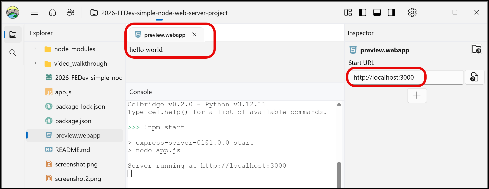
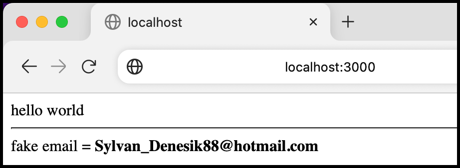

# 2026-FEDev-simple-node-web-server-project

A simple Node.js web server project - to test your Node install for web development.


## how to create this project from scratch

1. Create directory for project

    ```bash
    >>> mkdir project1
    ```

2. cd into directory

    ```bash
    >>> cd project1
    ```

3. Initialise directory as a Node.js project:

    ```bash
    >>> npm init -y
   
   Wrote to /Users/matt/Downloads/temp/project1/package.json:

    {
    "name": "project1",
    "version": "1.0.0",
    "description": "",
    "main": "index.js",
    "scripts": {
    "test": "echo \"Error: no test specified\" && exit 1"
    },
    "keywords": [],
    "author": "",
    "license": "ISC"
    }

    ```

   - NOTE: The `-y` option says "yes" to all the defaults

4. Install the Express server package:

    ```bash
    >>> npm install express
    
    added 65 packages, and audited 66 packages in 2s
    
    22 packages are looking for funding
    run `npm fund` for details
    
    found 0 vulnerabilities
    ```

5. Create main application file, e.g. `app.js` or `server.js`:

   - you should now have the following folder structure:

    ```bash
    |_node_modules\
    | |____(lots of files)
    |___package-lock.json
    |___package.json
    |___app.js
    ```
   
6. The project dependencies are in file `package.json`

    ```json 
    // file: package.json

    {
        "name": "project1",
        "version": "1.0.0",
        "description": "",
        "main": "index.js",
        "scripts": {
            "test": "echo \"Error: no test specified\" && exit 1"
        },
        "keywords": [],
        "author": "",
        "license": "ISC",
        "dependencies": {
            "express": "^5.2.1"
        }
    }
    ```

7. Add a `start` script shortcut to run the web server (`app.js`). Do this by adding to file `package.json` the following line in the `scripts` property:

   ```json
          "start": "node app.js"
   ```

    - also, ensure you add a comma `,` to the end of the previous line (the existing `test` script). The `scripts` property should now looks as follows:

   ```json
   // file: package.json

   {
     ...
     "scripts": {
       "test": "echo \"Error: no test specified\" && exit 1",
       "start": "node app.js"
    },
    ...
   }
   ```
   
10. Write a simple `app.js` file to return `Hello world` to every HTTP request:

   ```javascript
   // file: app.js

   const express = require('express')
   const app = express()
   const port = 3000
   
   // return a response containing "hello world"
   function handleRequest(request, response) {
        let pageContent = "hello world";
        response.send(pageContent)
   }
   
   // when request made to root of web server, execute the handleRequest() function
   app.get('/', handleRequest);
   
   // run the web server at port 3000
   app.listen(port, () => {
       console.log('Server running at http://localhost:' + port);
   });
   ```

11. You can now run the web server with:

   ```bash
   npm start
   ```

   Open a web browser or web preview to URL  `http://localhost:3000`, and you should now see the  `hello world` string output from our `handleRequest()` JavaScript function in `app.js`:

   

   
13. Let's add the Faker package to this project:
   
   ```bash
   >>> npm install @faker-js/faker
   
   added 1 package, and audited 67 packages in 975ms
   
   23 packages are looking for funding
   run `npm fund` for details
   
   found 0 vulnerabilities
   ```

14. Let's now use this to return a random email address each time the home page is requested:

   ```javascript
   // file: app.js

   const express = require('express')
   const app = express()
   const port = 3000
   
   const { faker } = require('@faker-js/faker');
   
   function handleRequest(request, response) {
      let fakeEmail = faker.internet.email();
      let pageContent = "hello world";
      pageContent +=  "<hr>";
      pageContent +=  "fake email = <b>" + fakeEmail + "</b>";
      response.send(pageContent)
   }
   
   // respond with "hello world" when a GET request is made to the homepage
   app.get('/', handleRequest);
   
   app.listen(port, () => {
      console.log('Server running at http://localhost:' + port);
   });
   ```

Again, open a web browser or web preview to URL  `http://localhost:3000`, and you should now see the  `hello world` string folowed by a random email address output from our `handleRequest()` JavaScript function in `app.js`:



Each time you refresh the web view you should see a new random email displayed, as function `handleRequest()` is executed for each new HTTP `GET` request to the root of the web server `/`.
